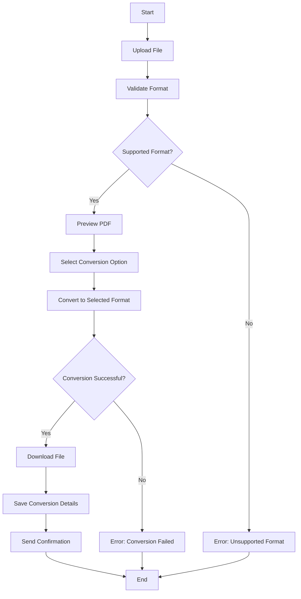

# PDFify: Your PDF Conversion Partner

PDFify is a comprehensive PDF conversion tool that provides seamless functionality to convert PDFs into various formats, including text, images, Word documents, Excel sheets, and PowerPoint presentations. Built with Python and Flask, it simplifies handling and processing PDFs in a user-friendly web interface.

---

## Features
- **PDF to Text**: Extract textual content from PDFs.
- **PDF to Image**: Convert each page of a PDF into high-quality images.
- **PDF to Word**: Generate editable Word documents (.docx) from PDFs.
- **PDF to Excel**: Extract tables from PDFs into structured Excel spreadsheets.
- **PDF to PowerPoint**: Convert PDFs into editable PowerPoint presentations (.pptx).
- **API-First Design**: RESTful APIs for integrating PDF conversion into your applications.

---

## Tech Stack

### Backend
- **Flask**: Web framework to build the server-side functionality.
- **Flask-CORS**: Enable cross-origin requests for seamless integration with frontends.

### Libraries Used
- **PyPDF2**: Extract text and metadata from PDF files.
- **PyMuPDF (fitz)**: Handle PDF pages and perform rendering for image conversion.
- **python-docx**: Create Word documents from PDF content.
- **Pillow**: Process and manipulate images.
- **Tabula**: Extract tabular data from PDFs.
- **Pandas**: Process and structure tabular data extracted from PDFs.
- **python-pptx**: Generate PowerPoint presentations from PDF content.
- **beautifulsoup4**: Web scraping to process additional content from PDFs (optional).
- **camelot-py**: Table extraction from PDFs.
- **pdf2docx**: Convert PDFs to Word documents.

---

## Flowchart

Below is the flowchart for the **PDFify** PDF conversion process:



---

## Directory Structure

```
PDFify
├── frontend
│   ├── node_modules/
│   ├── public/
│   ├── src/
│   │   ├── pages/
│   │   │   ├── main.jsx
│   │   │   ├── global.css
│   ├── .gitignore
│   ├── package.json
│   ├── package-lock.json
├── backend
│   ├── uploads/
│   │   └── <pdf-files>  # All PDF files to be processed
│   ├── output/
│   │   ├── <converted-pdf-files>  # Converted PDFs
│   ├── converted/
│   │   ├── excel/
│   │   │   └── <converted-excel-files>
│   │   ├── images/
│   │   │   └── <converted-images>
│   │   ├── ppt/
│   │   │   └── <converted-ppt-files>
│   │   ├── text/
│   │   │   └── <converted-text-files>
│   │   ├── word/
│   │   │   └── <converted-word-files>
│   ├── .env
│   ├── server.js
│   ├── package.json
├── Readme.md
├── requirements.txt
```

---

## Installation

1. Clone the repository:
   ```bash
   git clone https://github.com/RaoVrn/PDFify.git
   cd PDFify
   ```

2. Set up a virtual environment (optional but recommended):
   ```bash
   python -m venv venv
   source venv/bin/activate  # On Windows: venv\Scripts\activate
   ```

3. Install dependencies:
   ```bash
   pip install -r requirements.txt
   ```

4. Run the application:
   ```bash
   python app.py
   ```

5. Access the app at `http://localhost:5000`.

---

## API Endpoints

1. **PDF to Text**
   - **Endpoint**: `/convert-text`
   - **Method**: `POST`
   - **Input**: PDF file
   - **Output**: Extracted text in JSON format.

2. **PDF to Image**
   - **Endpoint**: `/convert-image`
   - **Method**: `POST`
   - **Input**: PDF file
   - **Output**: Images (PNG/JPEG) for each page.

3. **PDF to Word**
   - **Endpoint**: `/convert-word`
   - **Method**: `POST`
   - **Input**: PDF file
   - **Output**: Downloadable Word document (.docx).

4. **PDF to Excel**
   - **Endpoint**: `/convert-excel`
   - **Method**: `POST`
   - **Input**: PDF file
   - **Output**: Downloadable Excel spreadsheet (.xlsx).

5. **PDF to PowerPoint**
   - **Endpoint**: `/convert-powerpoint`
   - **Method**: `POST`
   - **Input**: PDF file
   - **Output**: Downloadable PowerPoint presentation (.pptx).

---

## Usage

### Convert PDF to Text:
1. Upload your PDF to the `/convert-text` endpoint.
2. Retrieve extracted text in JSON response.

### Convert PDF to Image:
1. Upload a PDF to the `/convert-image` endpoint.
2. Download images generated for each page.

### Convert PDF to Word:
1. Use the `/convert-word` endpoint with a PDF.
2. Download the .docx file for editing.

### Convert PDF to Excel:
1. Send a PDF with tabular data to the `/convert-excel` endpoint.
2. Receive the structured Excel sheet for data analysis.

### Convert PDF to PowerPoint:
1. Upload your PDF to the `/convert-powerpoint` endpoint.
2. Download the .pptx file for presentation.

---

## Contribution

Contributions are welcome! Follow these steps to contribute:
1. Fork the repository.
2. Create a feature branch:
   ```bash
   git checkout -b feature/your-feature-name
   ```
3. Commit your changes and push to the branch.
4. Submit a pull request.

---

## License
This project is licensed under the [MIT License](LICENSE).

---

## Author
- **Varun Prakash**
- [GitHub](https://github.com/RaoVrn)
- [Email](mailto:prakash.varun.0305@gmail.com)

---

## Acknowledgements
- Thanks to the maintainers of Flask, PyPDF2, PyMuPDF, python-docx, Pillow, Tabula, Pandas, and python-pptx for their robust libraries.
